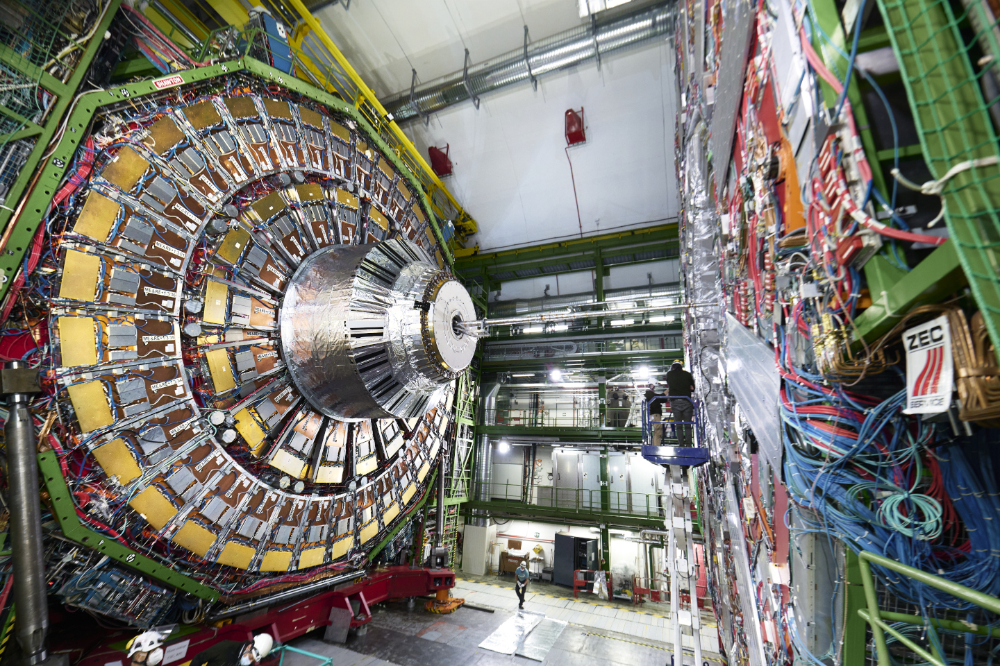
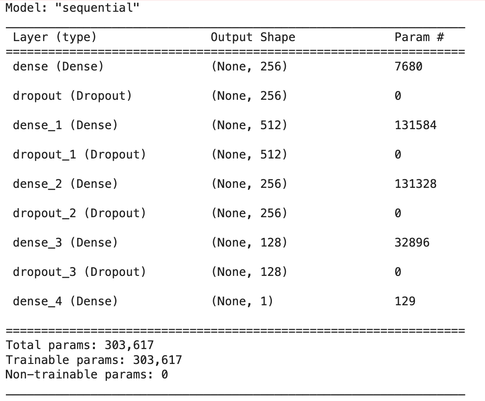
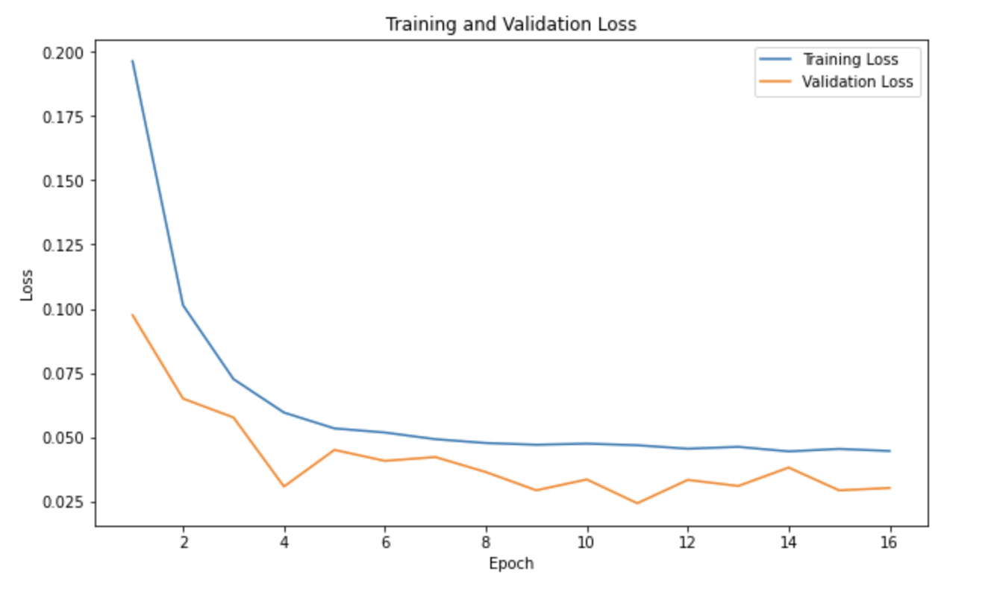

## 🚀 CERN Invariant Mass Prediction using Deep Learning

This project builds deep learning models to predict the **invariant mass** of electron collision events at **CERN** using simulated data.  
Predicting invariant mass is crucial for identifying and studying fundamental particles like the Higgs boson.

  

- 🎯 Invariant mass helps physicists detect rare particle interactions.
- ⚡ Faster, ML-based predictions can assist in real-time data analysis at particle accelerators.
- 🧠 Exploring machine learning applications in high-energy physics is a growing frontier!

### Methods
- **Dataset**: Simulated electron collision events.
- **Preprocessing**: Normalized features such as energy and momentum.
- **Models Used**:  
  - Fully Connected Neural Networks (Deep Learning)
  - Baseline Linear Models for comparison
 

  

- Evaluation Metrics: Mean Absolute Error (MAE), visualization of prediction accuracy.

### Tech Stack
- Python 🐍
- TensorFlow / Keras 🔥
- NumPy / Pandas 📊
- Matplotlib / Seaborn 📈

## 📈 Results

  

- Neural networks significantly outperform traditional models.
- Achieved a Mean Squared Error of only 0.181 GeV on the test set.

---
